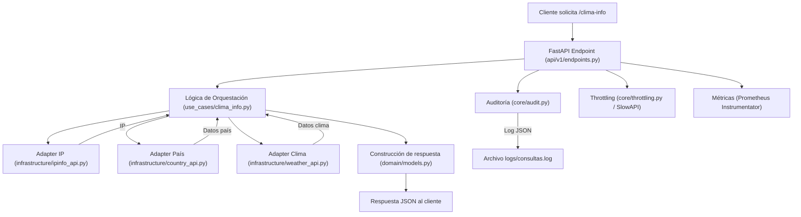

# Weather Info Microservice

Microservicio público de información climática y geográfica.

## Estructura

- app/api/v1/endpoints.py: Endpoint principal `/clima-info`
- app/domain/models.py: Modelos de dominio y respuesta
- app/use_cases/clima_info.py: Lógica de negocio
- app/infrastructure/: Adapters para APIs externas
- app/core/: Configuración, middlewares, utilidades
- app/main.py: Arranque de FastAPI
- tests/: Pruebas

## Despliegue local en Minikube

Consulta la guía completa de despliegue y pruebas en:

- [minikube-setup.md](./minikube-setup.md)

## Diagrama de flujo de la solicitud

Puedes ver el diagrama Mermaid en [docs/flujo_solicitud.mmd](docs/flujo_solicitud.mmd).

<details>
<summary>Ver diagrama Mermaid</summary>


</details>

## Uso con Poetry

1. Instala Poetry si no lo tienes:
   ```bash
   pip install --user poetry
   ```
2. Instala dependencias:
   ```bash
   poetry install
   ```
3. Crea el archivo `.env` con tu clave de OpenWeatherMap (ver `.env.example`).
4. Activa el entorno virtual:
   ```bash
   poetry env use python3.11  # Opcional, para fijar versión
   poetry env activate
   ```
5. Ejecuta la app:
   ```bash
   poetry run uvicorn app.main:app --reload
   ```
6. Prueba el endpoint en:
   ```
   http://localhost:8000/api/v1/clima-info
   ```

## Documentación interactiva

- Swagger UI: http://localhost:8000/docs
- Redoc: http://localhost:8000/redoc

## Limitación conocida: Mensaje de error de rate limit (SlowAPI)

> **Nota:** Cuando se excede el límite de peticiones por IP, SlowAPI responde con un mensaje en inglés por defecto:
>
> ```json
> { "error": "Rate limit exceeded: 5 per 1 minute" }
> ```
>
> Esto ocurre porque el middleware de SlowAPI responde antes de que FastAPI pueda usar el handler personalizado. No afecta la protección ni la funcionalidad, pero el mensaje no puede ser personalizado fácilmente. Si se requiere un mensaje en español, se recomienda implementar un rate limit custom o usar otra librería.
